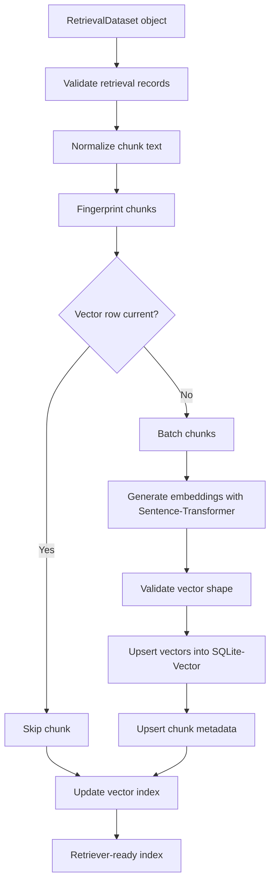

# Embedding Pipeline

The embedding pipeline converts wiki retrieval records into searchable vector rows. It consumes the in-memory `RetrievalDataset` object returned by the wiki pipeline, creates embeddings with Sentence-Transformer, stores vectors and metadata in SQLite-Vector, and updates vault-level vector index metadata.

The pipeline should be incremental. Re-running it should embed only new or changed chunks unless the embedding model, normalization settings, or storage schema changed.



## Inputs

- `vault_path`: Root path of the Obsidian vault.
- `RetrievalDataset`: Wiki-generated Python object containing retrieval records for one or more documents.
- `DocumentManifest` data from the same wiki run, including source fingerprint and generated file hashes.
- `embedding_options`: Model name, batch size, device, text normalization settings, and overwrite policy.
- Existing SQLite-Vector database, when updating an existing index.

The embedding pipeline should not parse PDFs, regenerate wiki notes, or read retrieval records back from disk during normal execution. Its source of truth is the `RetrievalDataset` object emitted by the wiki pipeline.

## Outputs

- SQLite-Vector database containing vector rows.
- Chunk metadata tables containing source paths, object IDs, section IDs, source coordinates, and hashes.
- Updated `system/vector-index.json`.
- Optional embedding run report for warnings, skipped chunks, failures, and counts.

## Pipeline Stages

### 1. Receive Retrieval Dataset

Accept a `RetrievalDataset` Python object from the wiki pipeline.

The object should contain:

- Document-level identity and source fingerprint.
- One or more retrieval records.
- Optional manifest data from the same wiki run.
- Optional generation warnings.

The pipeline may support a maintenance mode that rebuilds from persisted metadata, but the normal parse-to-wiki-to-embedding path should pass Python objects directly to avoid unnecessary disk I/O.

Recommended object shape:

```python
@dataclass(frozen=True)
class RetrievalDataset:
    documents: list[RetrievalDocument]
    warnings: list[str]


@dataclass(frozen=True)
class RetrievalDocument:
    id: str
    document_slug: str
    source_fingerprint: str
    manifest_hash: str
    chunks: list[RetrievalChunk]


@dataclass(frozen=True)
class RetrievalChunk:
    id: str
    document_id: str
    document_slug: str
    title: str
    text: str
    note_path: str
    link_target: str
    content_kind: str
    section_id: str | None
    object_id: str | None
    source_page: int | None
    source_bbox: tuple[float, float, float, float] | None
    source_hash: str
```

### 2. Validate Retrieval Records

Validate every retrieval record before embedding.

Required fields:

- Chunk ID.
- Document ID.
- Document slug.
- Note path.
- Link target.
- Text used for embedding.
- Human-readable title.

Recommended fields:

- Section ID or object ID.
- Source page and bounding box.
- Content kind, such as `section`, `equation`, `table`, `figure`, `reference`, or `concept`.
- Source content hash from the wiki stage.

Validation should reject records with empty embedding text, unsafe paths, duplicate chunk IDs within a document, or links that point outside the vault.

### 3. Normalize Chunk Text

Normalize text before embedding so repeated runs produce stable vectors.

Recommended normalization:

1. Convert line endings to `\n`.
2. Trim leading and trailing whitespace.
3. Collapse repeated blank lines.
4. Preserve math, citation keys, and technical identifiers.
5. Preserve table header labels and figure captions.
6. Remove Obsidian-only display syntax when it adds no semantic value.

Normalization should be conservative. The retriever should be able to explain why a chunk matched by showing text that is still recognizable to a user.

### 4. Fingerprint Chunks

Compute a chunk fingerprint from:

- Normalized embedding text.
- Document ID.
- Chunk ID.
- Source note path.
- Embedding model name.
- Embedding model revision when available.
- Normalization version.

The fingerprint is used to decide whether an existing vector row is current. If any fingerprint component changes, the chunk should be re-embedded.

### 5. Select Chunks for Embedding

Compare planned chunk fingerprints against stored vector metadata.

Chunk actions:

- `skip`: Existing row is current.
- `insert`: Chunk has no stored vector.
- `update`: Chunk exists but fingerprint changed.
- `delete`: Stored chunk no longer appears in the latest `RetrievalDataset` for its document.

Deletes should be scoped by document ID and manifest data so one document update cannot remove vectors that belong to another document.

### 6. Batch Embedding Requests

Group chunks into batches for Sentence-Transformer inference.

Batching should account for:

- Model max sequence length.
- Available CPU, GPU, or Apple Silicon acceleration.
- Memory pressure from long sections, tables, or equations.
- Stable output ordering so vector rows map back to chunk IDs.

If a chunk is too long for the model, split it into deterministic subchunks and record parent-child relationships in metadata. Prefer splitting on Markdown headings, paragraphs, list boundaries, and table rows before using token-count boundaries.

### 7. Generate Embeddings

Generate embeddings with Sentence-Transformer.

The embedding run must record:

- Model name.
- Model revision or local model fingerprint when available.
- Vector dimension.
- Distance metric expected by retrieval.
- Device used for inference.
- Batch size.
- Normalization version.
- Pipeline version.

Embeddings should be generated from normalized chunk text only. Metadata fields such as title and path may be prepended to the embedding text only if the same formatting is recorded in the normalization version.

### 8. Validate Vector Shape

Validate every vector before writing it.

Checks:

- Vector dimension matches the model metadata.
- Vector contains finite numeric values.
- Vector is not all zeros.
- Chunk count equals vector count for the batch.
- Vector dtype is compatible with SQLite-Vector storage.

Shape validation failures should stop the write for the affected batch.

### 9. Upsert SQLite-Vector Rows

Store vectors and metadata transactionally.

Recommended logical tables:

- `embedding_collections`: One row per vault, model, metric, and normalization version.
- `embedding_chunks`: One row per chunk or subchunk.
- `embedding_vectors`: Vector payloads indexed by SQLite-Vector.
- `embedding_runs`: Run-level audit data and counts.

`embedding_chunks` should include:

- Chunk ID.
- Parent chunk ID when split.
- Document ID.
- Document slug.
- Content kind.
- Section ID or object ID.
- Note path.
- Link target.
- Source page and bounding box.
- Title.
- Text hash.
- Chunk fingerprint.
- Created and updated timestamps.

The vector row should reference chunk metadata by a stable internal ID. Human-facing retrieval results should use `note_path` and `link_target`, not the internal row ID.

### 10. Update Vector Index Metadata

Update `system/vector-index.json` after vector writes complete.

The index should include:

- Schema version.
- SQLite database path.
- Active collection ID.
- Model name and revision.
- Vector dimension.
- Distance metric.
- Normalization version.
- Indexed document IDs and document slugs.
- Chunk counts by document.
- Last successful run timestamp.
- Warnings from the latest run.

This file lets other parts of the application find the current vector store without inspecting SQLite internals.

### 11. Prune Stale Vectors

Remove stale vectors after successful upserts.

Pruning rules:

1. Delete vectors for chunks removed from the latest `RetrievalDataset` for that document.
2. Delete old subchunks when a parent chunk is re-split.
3. Keep vectors from other documents untouched.
4. Keep old model collections unless an explicit cleanup command requests removal.
5. Record prune counts in the embedding run report.

## Retrieval Contract

The retriever should use the active collection from `system/vector-index.json`.

Query flow:

1. Normalize the query text with the same query normalization version.
2. Embed the query with the same Sentence-Transformer model as the active collection.
3. Search SQLite-Vector for nearest vectors using the configured distance metric.
4. Join vector results with chunk metadata.
5. Return note path, link target, title, content kind, score, source coordinates, and excerpt text.

Retrieval results should always be traceable back to Obsidian notes. A result without a valid vault path should be treated as corrupt metadata.

## Idempotency

The embedding pipeline must be safe to run repeatedly.

Rules:

1. Use chunk fingerprints to skip unchanged chunks.
2. Use database transactions for batch writes.
3. Never delete another document's vectors during a document-scoped run.
4. Keep model-specific collections separate.
5. Re-embed all chunks when model, model revision, vector dimension, metric, or normalization version changes.
6. Write `system/vector-index.json` only after the SQLite transaction succeeds.

## Error Handling

Recommended error categories:

- `invalid-retrieval-record`: Required chunk metadata is missing or malformed.
- `unsafe-path`: A retrieval path escapes the vault.
- `model-load-failed`: Sentence-Transformer model cannot be loaded.
- `embedding-failed`: Model inference failed for a chunk or batch.
- `vector-shape-invalid`: Generated vector has the wrong dimension or invalid values.
- `database-write-failed`: SQLite transaction failed.
- `stale-index`: `system/vector-index.json` does not match the SQLite database.

Recoverable warnings should be written to the embedding run report and `system/vector-index.json`.

## Minimal Implementation Order

1. Accept and validate a `RetrievalDataset` for one document.
2. Normalize text and compute chunk fingerprints.
3. Generate Sentence-Transformer embeddings in batches.
4. Create SQLite tables and upsert chunk metadata plus vectors.
5. Write `system/vector-index.json`.
6. Add incremental skip, update, and delete behavior.
7. Add subchunking for long records.
8. Add multi-document indexing and stale collection cleanup.
