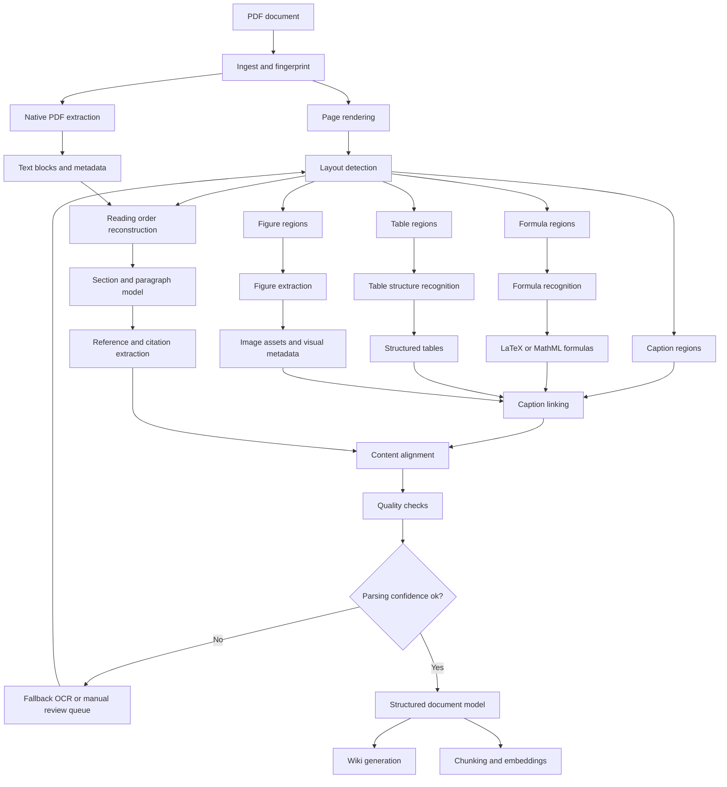

# PDF Parsing Pipeline

## Pipeline Design

1. Ingest the PDF, calculate a fingerprint, and store document-level metadata.
2. Render pages into images for layout analysis while also extracting native PDF text and metadata.
3. Detect layout regions, including paragraphs, headings, formulas, tables, figures, captions, references, headers, and footers.
4. Reconstruct reading order across columns, page breaks, captions, and footnotes.
5. Parse formulas separately from prose and normalize them into LaTeX or MathML.
6. Parse tables with cell boundaries, row and column spans, headers, captions, and source page coordinates.
7. Extract figures as image assets and preserve bounding boxes, captions, labels, and nearby references.
8. Link captions, formulas, tables, figures, references, and in-text mentions back into the surrounding section context.
9. Run quality checks for missing captions, low OCR confidence, broken reading order, malformed formulas, and invalid table geometry.
10. Retry weak regions with OCR or queue them for review.
11. Emit a structured document model for wiki generation, retrieval chunking, and embedding storage.

## Parsed Outputs

- **Document**: Title, authors, publication metadata, source fingerprint, and page count.
- **Sections**: Hierarchical headings, paragraphs, citations, footnotes, and reading order.
- **Formulas**: Recognized math, source coordinates, labels, equation numbers, and nearby explanatory text.
- **Tables**: Structured cells, headers, spans, captions, labels, and page coordinates.
- **Figures**: Extracted image files, captions, labels, page coordinates, and referenced sections.
- **References**: Bibliography entries and in-text citation links.
- **Quality Signals**: Confidence scores, fallback decisions, warnings, and review candidates.
