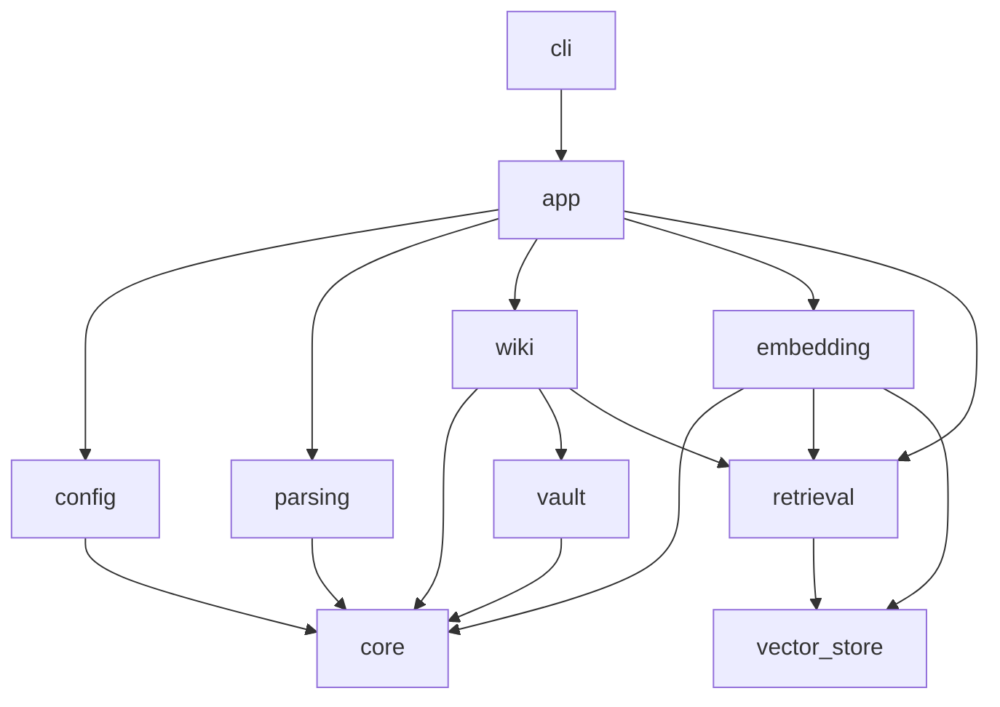

# Source Structure

The source tree should organize Nature around pipeline boundaries: configuration, parsing, wiki, embedding, vector storage, retrieval, and command orchestration. Each package owns one responsibility and communicates through typed Python objects rather than intermediate files when a direct in-process handoff is available.

## Target Layout

```text
src/
└── nature/
    ├── __init__.py
    ├── __main__.py
    ├── cli.py
    ├── app.py
    ├── config/
    │   ├── __init__.py
    │   ├── model.py
    │   └── loader.py
    ├── core/
    │   ├── __init__.py
    │   ├── errors.py
    │   ├── ids.py
    │   ├── paths.py
    │   └── hashing.py
    ├── parsing/
    │   ├── __init__.py
    │   ├── pipeline.py
    │   ├── model.py
    │   ├── ingest.py
    │   ├── rendering.py
    │   ├── native.py
    │   ├── layout.py
    │   ├── ocr.py
    │   ├── reading_order.py
    │   ├── formulas.py
    │   ├── tables.py
    │   ├── figures.py
    │   ├── references.py
    │   ├── alignment.py
    │   └── quality.py
    ├── wiki/
    │   ├── __init__.py
    │   ├── pipeline.py
    │   ├── model.py
    │   ├── planner.py
    │   ├── links.py
    │   ├── renderers.py
    │   ├── concepts.py
    │   ├── references.py
    │   ├── manifest.py
    │   └── writer.py
    ├── retrieval/
    │   ├── __init__.py
    │   ├── model.py
    │   ├── dataset.py
    │   ├── chunking.py
    │   └── search.py
    ├── embedding/
    │   ├── __init__.py
    │   ├── pipeline.py
    │   ├── model.py
    │   ├── normalize.py
    │   ├── fingerprint.py
    │   ├── sentence_transformer.py
    │   └── batching.py
    ├── vector_store/
    │   ├── __init__.py
    │   ├── sqlite.py
    │   ├── schema.py
    │   ├── migrations.py
    │   └── queries.py
    └── vault/
        ├── __init__.py
        ├── paths.py
        ├── frontmatter.py
        ├── markdown.py
        ├── csv.py
        ├── images.py
        └── index.py
```

The current flat `src/main.py` should become a thin compatibility entry point or be removed once `nature.cli` and `nature.__main__` exist.

## Package Responsibilities

### `nature.cli`

Owns command-line parsing and user-facing command dispatch.

Expected commands:

- `nature init`
- `nature parse`
- `nature wiki`
- `nature embed`
- `nature retrieve`
- `nature run`

The CLI should load configuration once, construct pipeline inputs, call `nature.app`, and format errors for humans. It should not contain parsing, wiki, embedding, or database logic.

### `nature.app`

Coordinates end-to-end workflows.

Responsibilities:

- Load and validate config.
- Run parse-to-wiki-to-embedding flows.
- Pass `RetrievalDataset` from wiki to embedding in memory.
- Return structured results for CLI or future API callers.

### `nature.config`

Owns `~/.nature/nature-config.json`.

- `model.py`: Pydantic options models with field constraints, enum values, path validators, and cross-field validators.
- `loader.py`: Read JSON, call the Pydantic root options model, create fixed internal paths, and return `NatureOptions`.

Fixed paths such as `~/.nature` and `~/.nature/cache` should be defined here or in `core.paths`, but they should not be user-configurable.

### `nature.core`

Provides shared infrastructure that is independent of any pipeline.

- `errors.py`: Structured exception types such as `InvalidConfig`, `InvalidInput`, `UnsafePath`, and `WriteConflict`.
- `ids.py`: Stable ID helpers.
- `paths.py`: Safe path expansion, vault-boundary checks, and fixed Nature paths.
- `hashing.py`: Content fingerprints and file hashes.

Pipeline packages may depend on `core`; `core` must not depend on pipeline packages.

### `nature.parsing`

Owns PDF parsing and emits `ParsedDocument`.

- `pipeline.py`: Public orchestration entry point.
- `model.py`: Parsed document schema objects.
- `ingest.py`: Source file validation and fingerprinting.
- `rendering.py`: Page image rendering.
- `native.py`: Native PDF text and metadata extraction.
- `layout.py`: Layout region detection.
- `ocr.py`: PaddleOCR PP-StructureV3 adapter.
- `reading_order.py`: Multi-column and page-break ordering.
- `formulas.py`: Formula extraction and normalization.
- `tables.py`: Table structure extraction.
- `figures.py`: Figure asset extraction.
- `references.py`: Citation and bibliography extraction.
- `alignment.py`: Caption, object, and section linking.
- `quality.py`: Confidence checks, warnings, and fallback decisions.

Parsing should not know about Obsidian paths, Markdown rendering, SQLite-Vector, or Sentence-Transformer.

### `nature.wiki`

Owns conversion from `ParsedDocument` to vault files and `RetrievalDataset`.

- `pipeline.py`: Public wiki entry point.
- `model.py`: Write plans, generated file records, manifests, and wiki result objects.
- `planner.py`: Deterministic vault path and filename planning.
- `links.py`: Obsidian link generation and link graph validation.
- `renderers.py`: Document, section, equation, table, figure, and reference rendering.
- `concepts.py`: Optional concept extraction and merging.
- `references.py`: Shared reference note handling.
- `manifest.py`: Manifest creation and previous-run comparison.
- `writer.py`: Atomic or ordered vault writes.

Wiki should return `RetrievalDataset` as a Python object. It should not require writing retrieval records to disk.

### `nature.retrieval`

Owns retrieval-facing data structures and search behavior.

- `model.py`: `RetrievalDataset`, `RetrievalDocument`, `RetrievalChunk`, and query result objects.
- `dataset.py`: Builders used by wiki to create retrieval datasets.
- `chunking.py`: Deterministic chunk and subchunk logic.
- `search.py`: Retriever orchestration over the vector store.

This package is shared by wiki, embedding, and retriever. It should remain independent of PDF parsing internals.

### `nature.embedding`

Owns text normalization, chunk fingerprinting, batching, and embedding generation.

- `pipeline.py`: Public embedding entry point.
- `model.py`: Embedding options, run reports, and planned chunk actions.
- `normalize.py`: Chunk text normalization.
- `fingerprint.py`: Chunk fingerprint calculation.
- `sentence_transformer.py`: Sentence-Transformer adapter.
- `batching.py`: Batch and long-chunk splitting logic.

Embedding consumes `RetrievalDataset` and writes vectors through `vector_store`. It should not read retrieval records from disk during normal execution.

### `nature.vector_store`

Owns SQLite-Vector persistence.

- `sqlite.py`: Connection management and transactions.
- `schema.py`: Table definitions.
- `migrations.py`: Schema migration runner.
- `queries.py`: Upsert, prune, and nearest-neighbor query functions.

The vector store should expose repository-style methods instead of leaking SQL across embedding and retrieval packages.

### `nature.vault`

Owns Obsidian-vault file mechanics.

- `paths.py`: Vault-relative path helpers.
- `frontmatter.py`: Markdown frontmatter serialization.
- `markdown.py`: Markdown rendering helpers.
- `csv.py`: CSV table writing with metadata comment rows.
- `images.py`: Figure metadata attachment when supported.
- `index.py`: `system/document-index.json` and `system/vector-index.json` updates.

This package should not make pipeline decisions. It provides safe file-format utilities used by wiki and embedding.

## Dependency Direction



Rules:

1. `core` has no dependencies on project pipeline packages.
2. `parsing` does not depend on `wiki`, `embedding`, `vector_store`, or `vault`.
3. `wiki` may depend on `parsing.model`, `retrieval.model`, `vault`, and `core`.
4. `embedding` depends on `retrieval` and `vector_store`, not on `wiki`.
5. `retrieval` may depend on `vector_store` for search, but retrieval models should stay storage-independent.
6. CLI and app orchestration are the only places that should call multiple top-level pipelines in sequence.

## Public Pipeline Interfaces

The main package APIs should be small and typed:

```python
def parse_document(input: ParseInput, config: ParsingOptions) -> ParsedDocument: ...

def wiki_document(
    document: ParsedDocument,
    input: WikiInput,
    config: WikiOptions,
) -> WikiResult: ...

def embed_dataset(
    dataset: RetrievalDataset,
    config: EmbeddingOptions,
    store: VectorStore,
) -> EmbeddingRunReport: ...

def retrieve(
    query: str,
    config: RetrieverOptions,
    store: VectorStore,
) -> list[RetrievalResult]: ...
```

`WikiResult` should include the generated manifest data and the in-memory `RetrievalDataset`.

## Testing Layout

Tests should mirror the package structure:

```text
tests/
├── config/
├── core/
├── parsing/
├── wiki/
├── retrieval/
├── embedding/
├── vector_store/
├── vault/
└── integration/
```

Use focused unit tests for deterministic planning, path safety, validation, chunking, fingerprinting, and SQL behavior. Use integration tests for parse-to-wiki and wiki-to-embedding handoffs.

## Migration From Current Layout

1. Create `src/nature/` and move package entry points there.
2. Add `nature.config`, `nature.core`, and typed models first.
3. Move parsed schema classes into `nature.parsing.model`.
4. Implement wiki planning and vault path helpers before rendering.
5. Add `nature.retrieval.model` so wiki can return `RetrievalDataset`.
6. Add embedding normalization and fingerprinting before model inference.
7. Add SQLite-Vector schema and repository methods.
8. Replace `src/main.py` with `nature.__main__` or a compatibility shim.
