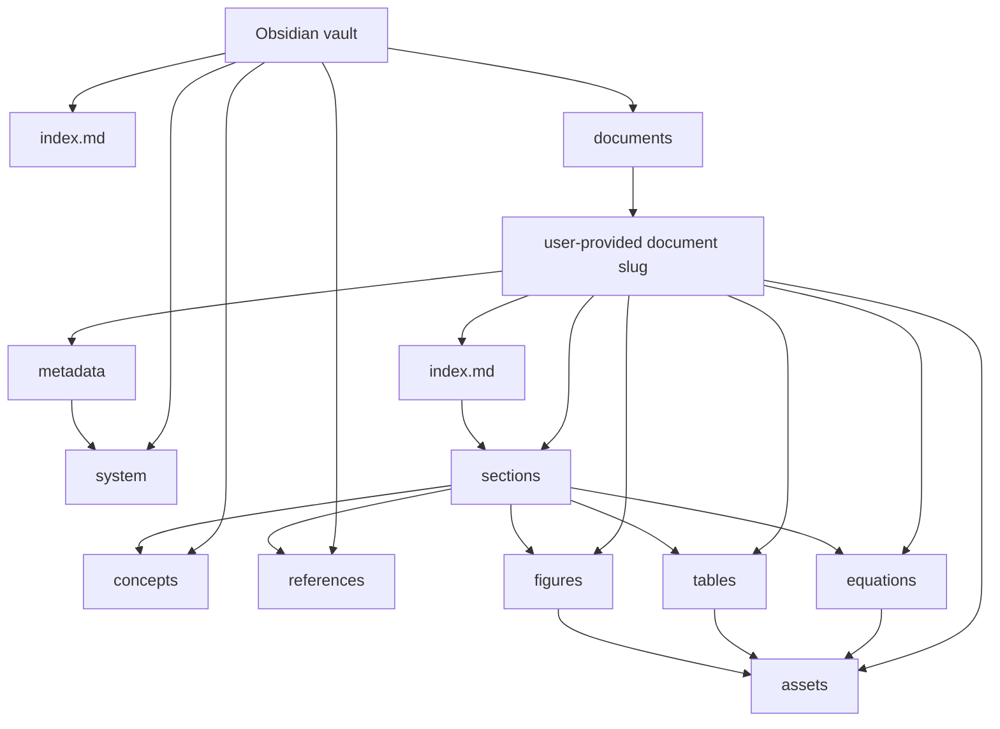

# Vault Structure

The vault is organized around source documents. Each parsed PDF owns its generated notes, equations, tables, figures, source assets, and extraction metadata. This keeps every paper or textbook self-contained and makes Obsidian navigation match the original document.



## Directory Layout

```text
vault/
├── index.md
├── documents/
│   └── <document-slug>/
│       ├── index.md
│       ├── sections/
│       │   ├── 000-abstract.md
│       │   ├── 001-introduction.md
│       │   └── <section-number>-<section-slug>.md
│       ├── equations/
│       │   └── eq-001.md
│       ├── tables/
│       │   └── table-001.csv
│       ├── figures/
│       │   └── fig-001.png
│       ├── assets/
│       │   ├── source.pdf
│       │   └── pages/
│       │       └── page-001.png
│       └── metadata/
│           ├── manifest.json
│           └── extraction.json
├── concepts/
│   └── <concept-name>.md
├── references/
│   └── <citation-key>.md
└── system/
    ├── document-index.json
    └── vector-index.json
```

## Document Directory

Each document directory is the main unit generated from one paper or textbook.

The `<document-slug>` directory name is a required user-provided parameter. The pipeline should not infer or rewrite it from the PDF title, authors, or publication year.

### `index.md`

The document index is the human-facing entry point for the source. It contains bibliographic metadata, a summary, and links to sections, references, and concepts. Equations are stored as Markdown notes. Tables and figures are stored as primary files with metadata attached to those files instead of separate sidecar metadata files.

Recommended frontmatter:

```yaml
---
type: document
document_id: <document-id>
title: <title>
authors: []
year:
kind: paper
source_pdf: assets/source.pdf
status: generated
---
```

### `sections/`

Section notes preserve the document reading order. They contain cleaned prose, citations, backlinks to concepts, and references to extracted object IDs.

Recommended filename pattern:

```text
<section-number>-<section-slug>.md
```

Recommended object references inside a section:

```markdown
## Equations

- `eq-001`

## Tables

- `table-001`

## Figures

- `fig-001`
```

### `equations/`

Equation notes preserve formulas as first-class Obsidian-readable objects. Metadata is stored in Markdown frontmatter, not in a separate metadata file.

Recommended files:

```text
equations/
└── eq-001.md
```

Recommended content:

```markdown
---
type: equation
document_id: <document-id>
equation_id: eq-001
label: Equation 1
page: 12
bbox: [72, 320, 520, 370]
section: ../sections/003-method.md
confidence: 0.97
---

$$
<latex>
$$

## Meaning

<generated explanation>
```

### `tables/`

Table files store machine-readable table content. Metadata should be attached inside the CSV file using leading comment rows, so there is no separate metadata file.

Recommended files:

```text
tables/
└── table-001.csv
```

Recommended metadata comments:

```csv
# type: table
# document_id: <document-id>
# table_id: table-001
# caption: <caption>
# page: 8
# bbox: [80, 140, 510, 420]
# section: ../sections/004-results.md
# confidence: 0.92
column_a,column_b,column_c
...
```

### `figures/`

Figure files store extracted image assets. Metadata should be attached to the image file where the format supports it, such as PNG text chunks, EXIF, or XMP. Section notes still reference the figure ID and may include the caption in prose.

Recommended files:

```text
figures/
└── fig-001.png
```

Recommended attached metadata:

```yaml
type: figure
document_id: <document-id>
figure_id: fig-001
caption: <caption>
page: 6
bbox: [96, 180, 502, 460]
section: ../sections/002-model.md
confidence: 0.94
mentions:
  - ../sections/002-model.md
```

### `assets/`

Assets are document-local files used by the generated notes. The original PDF and rendered page images stay here instead of a global asset folder.

### `metadata/`

Metadata stores machine-facing output from parsing and generation.

- `manifest.json`: Source fingerprint, generated file list, and version metadata.
- `extraction.json`: Raw and normalized parser output.

Retrieval records are normally passed from wiki to embedding as an in-memory Python object, not written as a required metadata file. A debug or audit mode may persist them, but the vault should not depend on that file for normal indexing.

## Shared Directories

### `concepts/`

Concept notes connect explanations across multiple documents. They link back to specific document sections and may reference equation, table, or figure IDs from those sections.

### `references/`

Reference notes represent bibliography entries. They collect backlinks from every document that cites the same source.

### `system/`

System files support indexing and retrieval across the whole vault. They are not intended for normal Obsidian browsing.

## Linking Rules

1. `documents/<document-slug>/index.md` links to all generated sections.
2. Section notes reference local equation, table, and figure IDs.
3. Equation metadata lives in Markdown frontmatter.
4. Table metadata lives in the table file itself.
5. Figure metadata is attached to the image file itself when supported.
6. Concept notes link to exact document sections and may cite local object IDs from those sections.
7. Reference notes link to every document and section where the citation appears.
8. Machine metadata stays in `metadata/` or `system/`; human-facing notes should not depend on reading JSON files.

## Naming Rules

1. Use the user-provided `<document-slug>` exactly as the document directory name.
2. Use source-local IDs for extracted objects: `eq-001`, `table-001`, `fig-001`.
3. Prefix section filenames with reading-order numbers.
4. Do not create sidecar metadata files for individual equations, tables, or figures.
5. Use readable concept filenames for shared knowledge notes.
