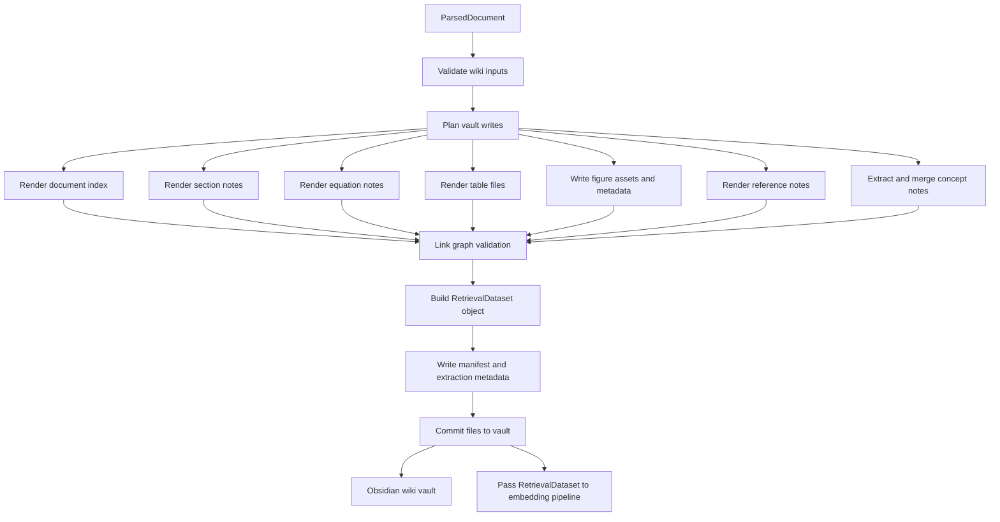

# Wiki Pipeline

The wiki pipeline converts a parsed PDF document into an Obsidian-readable knowledge base. It consumes the normalized `ParsedDocument` model from the PDF parsing pipeline, writes document notes, extracted object files, shared concept notes, reference notes, and machine metadata into the target vault, and returns retrieval data as an in-memory Python object for embedding.

The pipeline should be deterministic. Running it again for the same document slug and parsed document should produce stable paths, stable links, and a manifest that makes changed, removed, and regenerated files explicit.

## Inputs

- `ParsedDocument`: The normalized parser output described in `parsed-data-schema.md`.
- `vault_path`: Root path of the target Obsidian vault.
- `document_slug`: User-provided directory name under `vault/documents/`.
- `source_pdf`: Original PDF path or copied source asset.
- `wiki_options`: Rendering options such as overwrite policy, concept generation policy, and whether to include generated summaries.

The pipeline must use the user-provided `document_slug` exactly. It should not infer or rewrite the slug from title, authors, year, DOI, or PDF filename.

## Outputs

- `documents/<document-slug>/index.md`
- `documents/<document-slug>/sections/*.md`
- `documents/<document-slug>/equations/*.md`
- `documents/<document-slug>/tables/*.csv`
- `documents/<document-slug>/figures/*`
- `documents/<document-slug>/assets/source.pdf`
- `documents/<document-slug>/metadata/manifest.json`
- `documents/<document-slug>/metadata/extraction.json`
- In-memory `RetrievalDataset` Python object for embedding
- Shared `concepts/*.md`
- Shared `references/*.md`
- Updated `system/document-index.json`

## Pipeline Stages

### 1. Validate Wiki Inputs

Validate that the parsed model can be rendered before touching the vault.

Required checks:

1. `document.id`, `document_slug`, and source fingerprint are present.
2. Section IDs are unique and section order is total.
3. Equation, table, figure, and reference IDs are unique within the document.
4. Object references from sections point to existing objects.
5. Every equation, table, and figure points to an existing section.
6. Source page and bounding box data is valid when present.
7. The target vault path is writable.

Validation failures should stop the pipeline unless the failure only affects optional generated content, such as a missing summary.

### 2. Plan Vault Writes

Build an in-memory write plan before writing files. The plan maps every source object to its final vault path and link target.

The write plan owns:

- Document directory paths.
- Section filename slugs with reading-order prefixes.
- Local equation, table, and figure paths.
- Shared reference note paths.
- Shared concept note paths.
- Manifest entries for every generated file.
- Cleanup candidates from previous runs.

Existing user-edited files should not be overwritten blindly. Generated files must carry enough frontmatter or manifest metadata to distinguish files owned by the pipeline from manually created notes.

### 3. Render Document Index

Render `documents/<document-slug>/index.md` as the entry point for the source document.

The index should include:

- Document metadata frontmatter.
- Source title, authors, venue, year, DOI, and source asset link.
- A compact generated summary when available.
- Ordered links to section notes.
- Links to extracted equations, tables, and figures when useful.
- Links to references and concepts.
- Parsing quality status and warnings at a human-readable level.

The index should be useful in Obsidian without requiring users to inspect JSON metadata.

### 4. Render Section Notes

Render one Markdown note for each parsed section under `sections/`.

Section notes should preserve reading order and hierarchy while converting parser object references into Obsidian links.

Rendering rules:

1. Use the section's cleaned Markdown as the body.
2. Preserve inline citations and link them to `references/<citation-key>.md` when resolved.
3. Link mentioned equations, tables, and figures using local document-relative links.
4. Link recognized concepts to `concepts/*.md`.
5. Include frontmatter with document ID, section ID, title, level, order, and page span.
6. Include source-page anchors or coordinates only as compact metadata, not noisy prose.

### 5. Render Equations

Render every equation as a first-class Markdown note under `equations/`.

Each equation note should include:

- Frontmatter with document ID, equation ID, label, page, bounding box, section link, and confidence.
- A display math block containing normalized LaTeX.
- A generated meaning section when available.
- Backlinks to the section where the equation appears.

Equations should keep the source-local ID, such as `eq-001`, because section notes and the in-memory retrieval dataset depend on stable object identifiers.

### 6. Render Tables

Render every table as CSV under `tables/`.

The table CSV should include leading metadata comment rows for:

- Table ID and document ID.
- Caption and label.
- Page and bounding box.
- Source section link.
- Parser confidence and warnings.

Cell output should preserve row order, column order, row spans, column spans, and header intent where the parsed table model contains that information. If a table cannot be represented losslessly as flat CSV, preserve the readable CSV and record the lossy conversion warning in the manifest.

### 7. Write Figures

Write extracted figure image files under `figures/` and attach metadata when the image format supports it.

Figure metadata should include:

- Figure ID and document ID.
- Caption and label.
- Page and bounding box.
- Source section link.
- Parser confidence.
- Mentioned section IDs.

Section notes should link to figure assets by stable figure ID and include captions in surrounding prose when that improves readability.

### 8. Render References

Render shared bibliography notes under `references/`.

Reference note IDs should be stable citation keys derived from parser output. When two documents cite the same DOI or URL, the pipeline should merge backlinks into the same reference note. When identity is ambiguous, the pipeline should create separate notes and record the ambiguity in metadata.

Reference notes should include:

- Bibliographic frontmatter.
- Raw parser text for traceability.
- Links to every document and section that cites the reference.
- DOI, URL, arXiv ID, or other external identifiers when available.

### 9. Extract and Merge Concepts

Concept notes connect recurring scientific or engineering ideas across documents.

Concept extraction should run after section rendering because concept backlinks need final section paths. The concept stage may use headings, glossary-like phrases, emphasized definitions, equation meanings, captions, and generated summaries as candidates.

Concept merge policy:

1. Normalize candidate names using case folding, whitespace normalization, and punctuation cleanup.
2. Prefer existing concept notes when a normalized name already exists.
3. Keep aliases in frontmatter instead of creating duplicate notes.
4. Link concepts to exact section notes, not only to document indexes.
5. Record generated concept confidence in metadata.

The first implementation can make concept extraction optional. The rest of the wiki pipeline should work without generated concept notes.

### 10. Validate Link Graph

Validate generated links before committing writes.

Checks:

- Every internal link resolves to a planned file or an existing vault file.
- Every object ID referenced by a section resolves to a generated object.
- Shared reference and concept backlinks point to generated document or section notes.
- No generated path escapes the target vault.
- No two generated objects write to the same path.

Link graph failures should stop the pipeline because broken links make the vault difficult to trust.

### 11. Build Retrieval Dataset

Build an in-memory `RetrievalDataset` object after notes and links are planned.

The object should contain chunkable units and source mapping for embeddings:

- Chunk ID.
- Document ID and document slug.
- Note path.
- Object ID or section ID.
- Content kind.
- Source page and bounding box when available.
- Text used for embedding.
- Human-readable title.
- Link target for retrieval results.
- Source content hash.

This object is the primary handoff to the embedding pipeline. The wiki pipeline should pass it directly in Python instead of serializing it to disk and asking the embedding pipeline to read it back.

### 12. Write Metadata

Write machine-facing metadata after the human-facing notes have been rendered.

`manifest.json` should contain:

- Wiki schema version.
- Document ID and document slug.
- Source fingerprint.
- Pipeline version.
- Generated file list with content hashes.
- Warnings and lossy conversions.
- Previous-run cleanup decisions.

`extraction.json` should preserve the normalized parser output used for rendering.

Retrieval data should not be written as a required intermediate file. A debug or audit mode may optionally persist the `RetrievalDataset`, but normal pipeline execution should avoid that disk I/O.

### 13. Commit Files to Vault

The final write stage should be atomic at the document level when possible:

1. Write rendered content into a temporary document directory.
2. Validate file hashes and link graph.
3. Move new files into the target document directory.
4. Update shared concept, reference, and system index files.
5. Remove stale generated files that are still owned by the previous manifest.

If atomic replacement is not available, write files in dependency order: assets, object files, section notes, index note, metadata, then system indexes.

## Idempotency

The wiki pipeline must support repeated runs.

Rules:

1. Generated paths must be deterministic for the same input.
2. The manifest must identify pipeline-owned files.
3. Stale generated files can be removed only when they were created by a previous run for the same document slug.
4. User-created files should never be deleted by cleanup.
5. User edits to generated files should be detected by comparing the previous manifest hash with the current file hash.
6. When a generated file has user edits, the pipeline should either preserve it and write a conflict file or require an explicit overwrite option.

## Error Handling

Pipeline errors should be reported as structured failures.

Recommended error categories:

- `invalid-input`: Parsed model is missing required data.
- `unsafe-path`: A generated path escapes the vault.
- `link-resolution-failed`: A planned internal link has no target.
- `write-conflict`: A generated file has user edits or path collision.
- `lossy-render`: Parsed content cannot be represented exactly in the target file format.
- `metadata-write-failed`: Human-facing files were written but machine metadata failed.

Recoverable warnings should be written to `manifest.json` and surfaced in the document index.

## Integration With Embeddings

Wiki does not generate embeddings directly. It prepares stable retrieval records and returns them as a Python object for the embedding pipeline.

The embedding pipeline should consume the in-memory `RetrievalDataset`, generate vectors with Sentence-Transformer, and store vector rows in SQLite-Vector. Retrieval results should return both the text chunk and the Obsidian path so users can jump from semantic search results into the vault.

## Minimal Implementation Order

1. Validate `ParsedDocument` and build a write plan.
2. Render document index and section notes.
3. Render equations, tables, figures, and references.
4. Build the in-memory `RetrievalDataset`.
5. Write `manifest.json` and `extraction.json`.
6. Add link graph validation.
7. Add idempotent cleanup and conflict detection.
8. Add optional concept extraction and merging.
