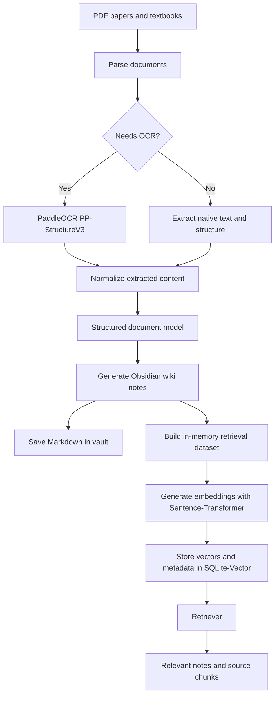

# Workflow

Nature loads required machine-local defaults from `~/.nature/nature-config.json` before running parsing, wiki, embedding, or retrieval. The full config shape is defined in `../configuration.md`.

## Steps

1. Collect paper and textbook PDF files.
2. Parse each document and run OCR when native text or layout extraction is insufficient.
3. Normalize extracted text, tables, figures, equations, sections, and metadata into a structured document model.
4. Generate Obsidian-compatible Markdown notes in the target vault.
5. Build an in-memory retrieval dataset from the wiki notes and parsed source mappings.
6. Pass the retrieval dataset directly to Sentence-Transformer embedding generation.
7. Store vectors and metadata in SQLite-Vector.
8. Retrieve relevant notes and source chunks for user queries.
