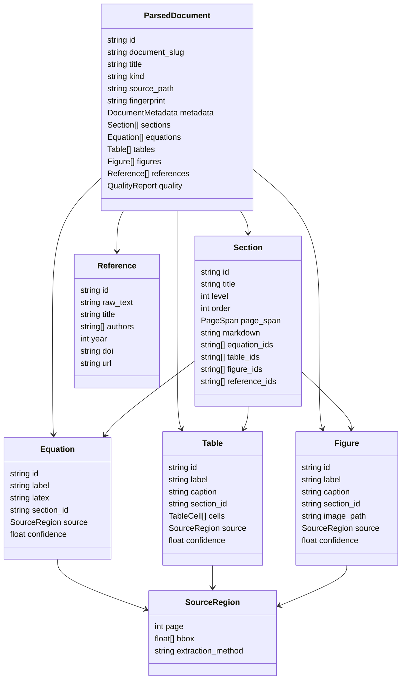

# Parsed Data Schema

The parsed data schema is the normalized output of the PDF parsing pipeline. It should be independent from Obsidian rendering, but it must contain enough stable IDs, source coordinates, and metadata to generate the vault structure.



## Top-Level Shape

```json
{
  "schema_version": "1.0",
  "document": {
    "id": "sha256:<hash>",
    "document_slug": "<user-provided-document-slug>",
    "kind": "paper",
    "source_path": "/path/to/source.pdf",
    "fingerprint": "<content-fingerprint>",
    "metadata": {},
    "sections": [],
    "equations": [],
    "tables": [],
    "figures": [],
    "references": [],
    "quality": {}
  }
}
```

## Core Objects

### `DocumentMetadata`

```json
{
  "title": "Document title",
  "authors": ["Author One", "Author Two"],
  "year": 2026,
  "venue": "Journal or conference",
  "doi": "10.xxxx/yyyy",
  "arxiv_id": "2501.00001",
  "language": "en",
  "page_count": 12
}
```

### `Section`

```json
{
  "id": "sec-001",
  "title": "Introduction",
  "level": 1,
  "order": 1,
  "page_span": {
    "start": 1,
    "end": 2
  },
  "markdown": "Cleaned section body with inline citations and object references.",
  "equation_ids": ["eq-001"],
  "table_ids": ["table-001"],
  "figure_ids": ["fig-001"],
  "reference_ids": ["smith2024method"]
}
```

### `Equation`

```json
{
  "id": "eq-001",
  "label": "Equation 1",
  "latex": "E = mc^2",
  "section_id": "sec-003",
  "source": {
    "page": 4,
    "bbox": [72, 320, 520, 370],
    "extraction_method": "ocr"
  },
  "confidence": 0.97,
  "meaning": "Generated explanation of the formula."
}
```

### `Table`

```json
{
  "id": "table-001",
  "label": "Table 1",
  "caption": "Evaluation results.",
  "section_id": "sec-004",
  "columns": ["Method", "Accuracy", "F1"],
  "cells": [
    {
      "row": 0,
      "column": 0,
      "value": "Baseline",
      "row_span": 1,
      "column_span": 1
    }
  ],
  "source": {
    "page": 8,
    "bbox": [80, 140, 510, 420],
    "extraction_method": "pp-structure"
  },
  "confidence": 0.92,
  "warnings": ["merged-cell-detected"]
}
```

### `Figure`

```json
{
  "id": "fig-001",
  "label": "Figure 1",
  "caption": "Model architecture.",
  "section_id": "sec-002",
  "image_path": "documents/<document-slug>/figures/fig-001.png",
  "source": {
    "page": 6,
    "bbox": [96, 180, 502, 460],
    "extraction_method": "pp-structure"
  },
  "confidence": 0.94,
  "mention_section_ids": ["sec-002"]
}
```

### `Reference`

```json
{
  "id": "smith2024method",
  "raw_text": "Smith et al. Example Method. 2024.",
  "title": "Example Method",
  "authors": ["Smith, Jane", "Lee, Min"],
  "year": 2024,
  "doi": "10.xxxx/yyyy",
  "url": "https://example.org/paper"
}
```

## Shared Types

### `SourceRegion`

`bbox` uses PDF page coordinates in the order `[x0, y0, x1, y1]`.

```json
{
  "page": 1,
  "bbox": [0, 0, 100, 100],
  "extraction_method": "native | ocr | pp-structure | manual"
}
```

### `QualityReport`

```json
{
  "overall_confidence": 0.91,
  "warnings": [
    {
      "code": "low-confidence-table",
      "message": "Table structure may contain merged cells.",
      "target_id": "table-001",
      "severity": "warning"
    }
  ],
  "fallbacks": [
    {
      "page": 3,
      "reason": "native-text-empty",
      "method": "ocr"
    }
  ]
}
```

## Vault Mapping

| Parsed object | Vault output |
| --- | --- |
| `ParsedDocument.document_slug` | `documents/<document-slug>/` |
| `Section` | `sections/<section-number>-<section-slug>.md` |
| `Equation` | `equations/<id>.md` |
| `Table` | `tables/<id>.csv` |
| `Figure` | `figures/<id>.png` |
| `Reference` | `references/<id>.md` |
| `QualityReport` | `metadata/extraction.json` |
